# MarsProject

**Drivable USD worlds of real places on Mars. Each world starts from NASA's
orbital maps of Jezero Crater and is finished by a Grok Imagine edit that adds
the sub-meter detail no instrument has measured.**

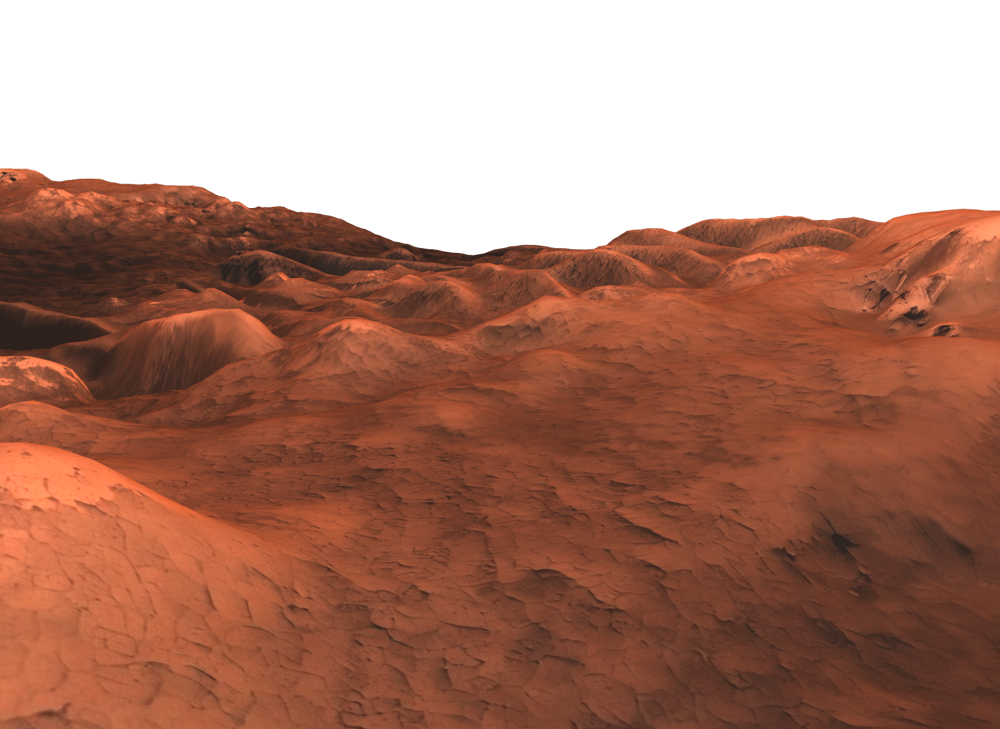

The repo ships **13 real Jezero worlds** in [`worlds/`](worlds/) plus the
pipeline to make more:

```bash
python scripts/generate_real_worlds.py --count 10 --jobs 3   # needs grok CLI + XAI_API_KEY
```

## Pipeline

```mermaid
flowchart LR
    A["USGS Jezero mosaics\nHiRISE 25 cm + DTM 1 m"] --> B["seed_canvas.py\ncrop a 160x180 m patch"]
    B --> C["seed canvas\nphoto | elevation"]
    C --> D["Grok agent\nauthors edit prompt\nfrom grok_skills/"]
    D --> E["Grok Imagine edit\n+ rover-scale detail"]
    E --> F["gates\nhm_detail_ratio()\n+ dtm_corr()"]
    F --> G["terrain_texture.png\n+ heightmap.png"]
    G --> H["recursive detail\nupscale() - 84\nGrok Imagine edits"]
    H --> I["terrain_hires.jpg\n8x resolution"]
    G --> J["build_scene.py\nheightmap -> mesh"]
    I --> J
    J --> K["scene.usda\nusdchecker + usdrecord gate"]
```

### 1. The real data

Two co-registered public USGS mosaics of Jezero Crater, built from images by
HiRISE aboard NASA's Mars Reconnaissance Orbiter, the highest-resolution
camera at another planet. USGS Astrogeology assembled them as the hazard
basemap for the Mars 2020 mission; Perseverance's Terrain Relative Navigation
matched its descent camera against these exact maps during the Feb 2021
landing.

- [HiRISE orthoimage, 25 cm/px](https://astrogeology.usgs.gov/search/map/Mars/Mars2020/JEZ_hirise_soc_006_orthoMosaic_25cm_Eqc_latTs0_lon0_first)
- [Stereo DTM, 1 m/px](https://astrogeology.usgs.gov/search/map/Mars/Mars2020/JEZ_hirise_soc_006_DTM_MOLAtopography_DeltaGeoid_1m_Eqc_latTs0_lon0_blend40)

The elevation comes from [stereo photogrammetry](https://www.uahirise.org/dtm/about.php):
two HiRISE passes photograph the same ground from different angles, and the
per-pixel parallax becomes height at ~1 m posts (vertical precision tens of
cm), tied to the MOLA laser-altimeter datum. 1 m/px is where orbital
elevation measurement stops: the photo resolves ~30 cm features, so
rover-scale rocks (0.2–0.5 m) are visible in the imagery but absent from the
elevation model.

`seed_canvas.py` scouts the mosaics by ranged HTTP reads (the multi-GB files
are never downloaded), picks a 160×180 m patch with medium relief, and
composes the pipeline's usual split canvas from real photo + real elevation:

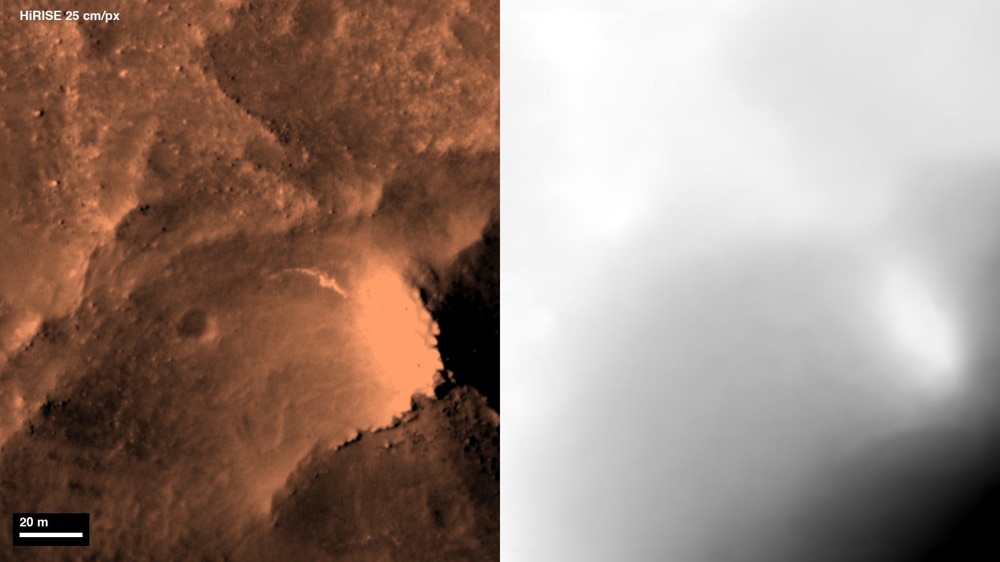

### 2. Grok Imagine: past the resolution limit

A skill-loaded Grok agent authors the edit prompt itself (its `imagine` and
game-asset skills, the same way it prompts its own image tool) and Grok
Imagine redraws the canvas: every landform stays in place, and both halves
gain rover-scale rocks, ripples and regolith; the heightmap half stays
matte pure elevation. The result is new 3D surface values: elevation the
instruments never measured, inferred from the photo that can see it.
Purpose-trained networks have shown single-image DTM estimation is viable for
planetary science; here a general-purpose image model does it zero-shot,
texture and heightmap jointly.

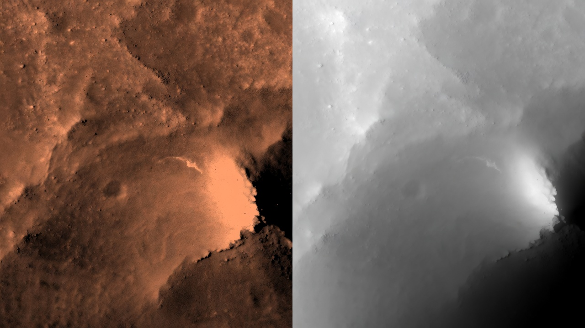

Guards in [`generate_real_worlds.py`](scripts/generate_real_worlds.py):

- `hm_detail_ratio()`: edge-energy ratio of heightmap half vs terrain half,
  same gate as the imagined worlds.
- `dtm_corr()`: correlation of the height half against the source DTM.
  Rejects the classic failure where the model reproduces photo luminance
  instead of drawing elevation (r ≈ 0.3 vs the required ≥ 0.45; accepted
  worlds score r ≈ 0.5–0.99). Prompt wording decides this: "keep every
  shadow" yields a photo copy, "matte pure elevation" yields height.

About half of edit attempts fail a gate and are retried; the gate scores of
every accepted world are recorded in its `meta.json`.

The same treatment on a second patch, seeded at the delta front:

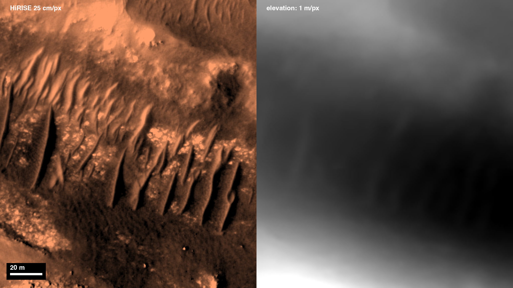

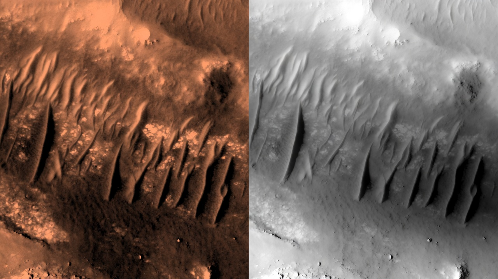

### 3. Recursive quadrant re-rendering: rover-camera density

Identical to the imagined-world pipeline: `upscale()` splits the texture into
4 overlapping quadrants, has Grok Imagine (`image_edit`) re-render each at
~2x density,
recurses three levels (`4 + 16 + 64 = 84` edit calls per world), color-matches
every tile to its source, and feather-stitches the tree back together for 8x
linear resolution. The heightmap is never touched, so geometry and
texture/elevation alignment are unchanged.

Same region of `jezero-pale-bowl`, base texture vs the re-rendered result:

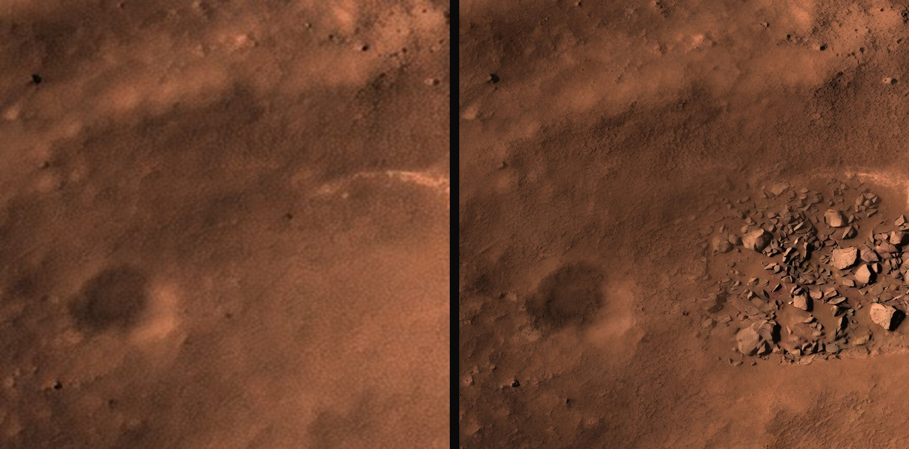

### 4. Scene assembly: `build_scene.py`

Deterministic Python from the two images to USD, unchanged from the imagined
worlds: heightmap to a displaced 35k-vertex grid mesh (44 m wide, Z-up,
meters), `UsdPreviewSurface` material with the hi-res texture, spawn
flattening, `OverheadCam` + `HeroCam`, Grok-generated sky dome. Every build
must pass `usdchecker` and proof-render with `usdrecord`.

Built from the raw data alone, the ground is 1 m smooth ramps with
nothing for a rover to learn on. Same spot, raw vs full pipeline:

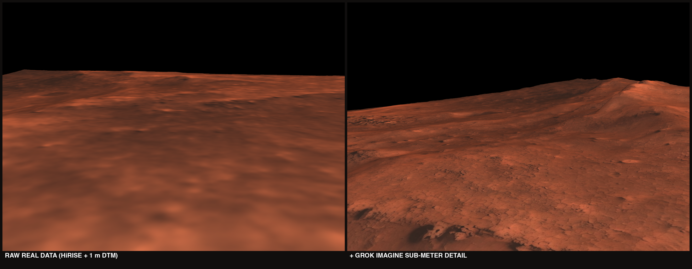

## The worlds

| World (titles by Grok) | Elevation range | Height-vs-DTM corr |
|---|---|---|
| [jezero-delta-real](worlds/jezero-delta-real/) | 27.1 m | +0.82 |
| [jezero-finger-ridges](worlds/jezero-finger-ridges/) | 25.1 m | +0.80 |
| [jezero-fluted-channel](worlds/jezero-fluted-channel/) | 19.7 m | +0.67 |
| [jezero-pale-bowl](worlds/jezero-pale-bowl/) | 35.7 m | +0.93 |
| [jezero-paleochannel-rise](worlds/jezero-paleochannel-rise/) | 25.9 m | +0.53 |
| [jezero-ribbed-dunefolds](worlds/jezero-ribbed-dunefolds/) | 17.4 m | +0.92 |
| [jezero-ribbed-dustfields](worlds/jezero-ribbed-dustfields/) | 25.2 m | +0.95 |
| [jezero-ridge-scarps](worlds/jezero-ridge-scarps/) | 34.1 m | +0.64 |
| [jezero-ridgeweave](worlds/jezero-ridgeweave/) | 21.2 m | +0.98 |
| [jezero-ripple-barrens](worlds/jezero-ripple-barrens/) | 15.9 m | +0.69 |
| [jezero-ripple-scarp](worlds/jezero-ripple-scarp/) | 19.2 m | +0.90 |
| [jezero-scarp-duality](worlds/jezero-scarp-duality/) | 12.5 m | +0.95 |
| [jezero-scarp-regolith](worlds/jezero-scarp-regolith/) | 29.6 m | +0.99 |

All hi-res textures are 5120x5760. Each world is self-contained and keeps its
full real-data provenance:

```
worlds/jezero-<slug>/
├── scene.usda                              # terrain mesh, cameras, lights
├── raw_vs_grok.png                         # same spot: raw data vs pipeline
└── assets/
    ├── grok_originals/
    │   ├── canvas.png                      # the untouched Grok edit
    │   ├── seed_canvas_realdata.png        # the real-data input canvas
    │   ├── real_dtm.npy                    # ground-truth 1 m elevation
    │   └── meta.json                       # patch coordinates + gate scores
    ├── terrain_texture.png                 # left half (base macro color)
    ├── heightmap.png                       # right half, verbatim
    ├── terrain_hires.jpg                   # 8x recursive upscale
    └── MarsSky.png                         # shared sky dome texture
```

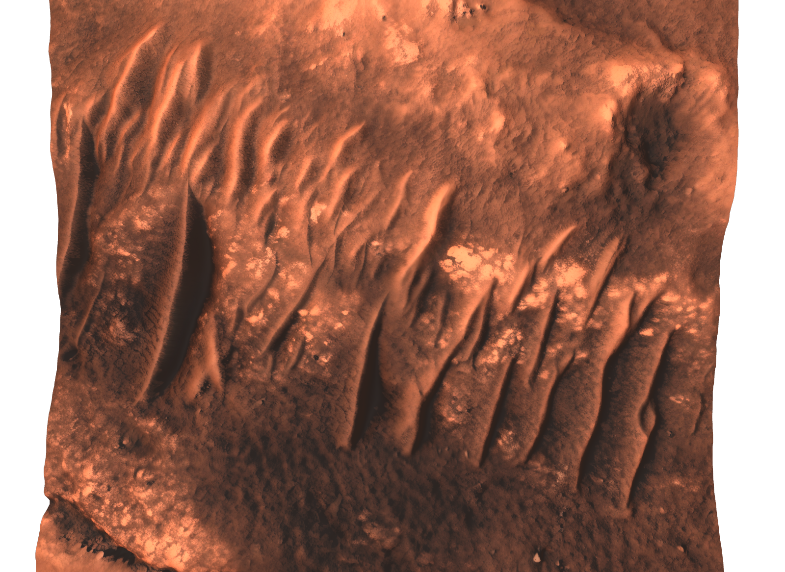

## Usage

```bash
python3 -m venv .venv && .venv/bin/pip install pillow numpy rasterio
grok login   # or export XAI_API_KEY

.venv/bin/python scripts/generate_real_worlds.py --count 10 --jobs 3  # full pipeline per world
.venv/bin/python scripts/seed_canvas.py [--center X Y]                # just extract a seed canvas
.venv/bin/python scripts/build_scene.py --assets <dir> --out scene.usda

usdchecker worlds/jezero-<slug>/scene.usda
usdrecord --camera /World/Cameras/HeroCam worlds/jezero-<slug>/scene.usda out.png
```

## From scratch

The same pipeline also runs without the seeding stage: one Grok Imagine call
invents both canvas halves, terrain and heightmap jointly, and everything
downstream is identical. One such world, [ochre-rift-caldera](worlds/ochre-rift-caldera/),
ships in `worlds/`:

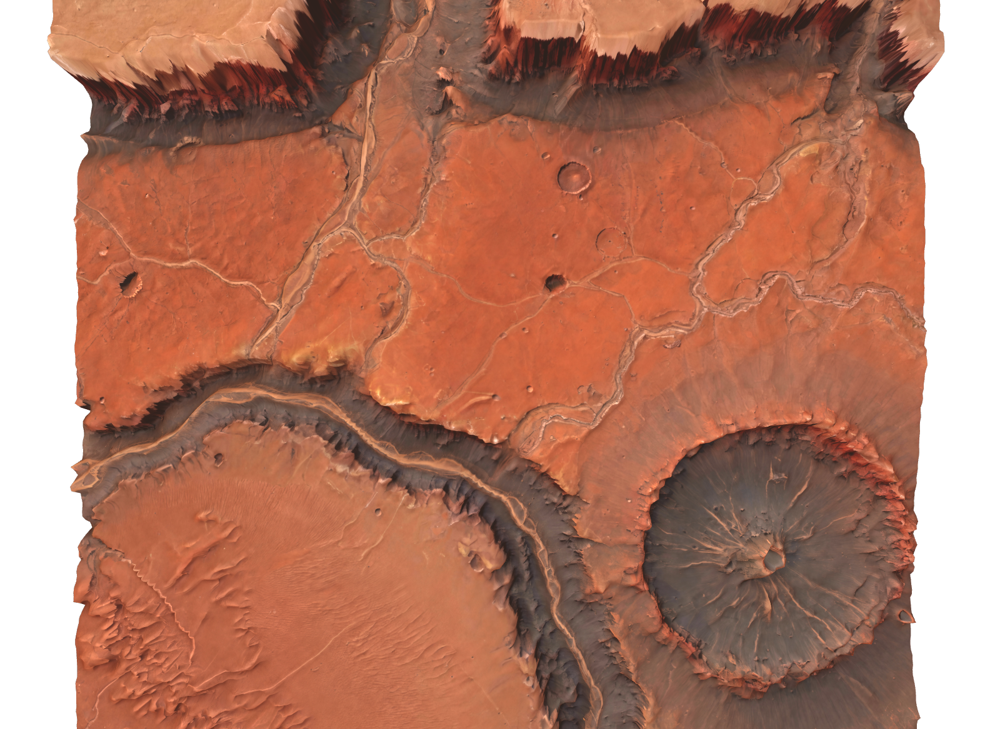

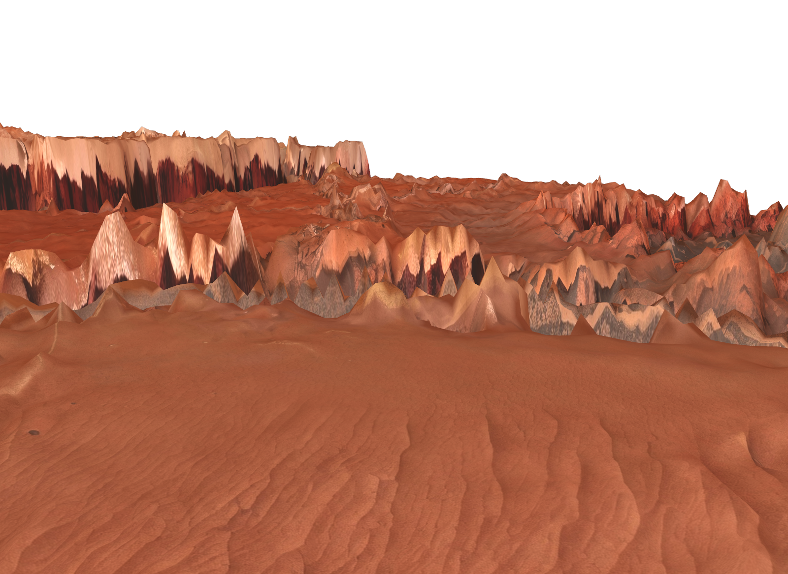
