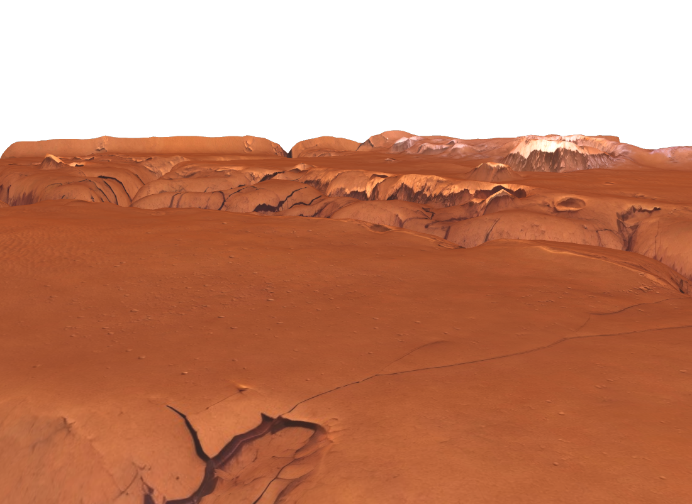
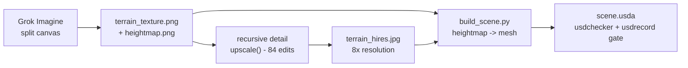
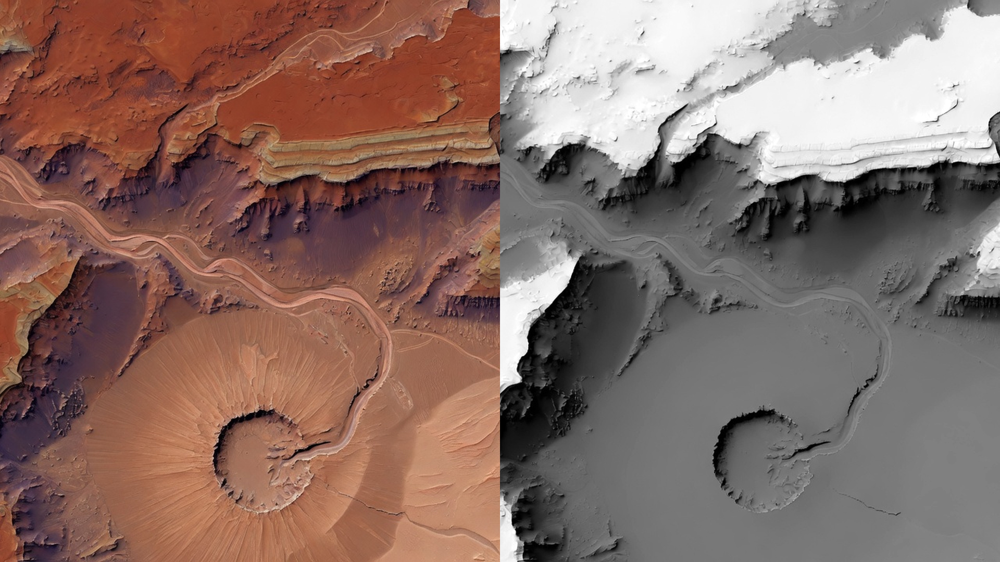
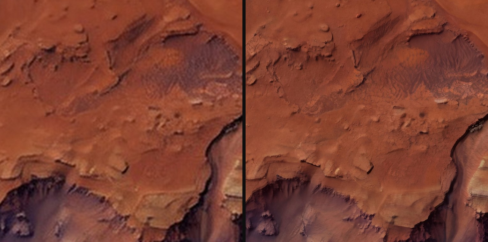

# MarsProject

**Mars terrain worlds for rover RL. Each world is generated by a single Grok Imagine call and assembled into a scene in standard USD format (`.usda`).**



The repo ships **10 generated worlds** in [`worlds/`](worlds/) plus the pipeline to make more:

```bash
python scripts/generate_worlds.py --count 10 --jobs 8   # needs grok CLI + XAI_API_KEY
```

## Pipeline



### 1. Split canvas: texture and heightmap from one generation

A terrain needs a color texture and a heightmap that agree. Generated separately they drift; generated as two halves of one canvas they stay aligned feature-for-feature.

Generation is two steps. First, a skill-loaded Grok agent (`author_canvas_prompt()`) is asked to write the Imagine prompt itself, the way it prompts its own image tool, and to invent a title:

> *load your imagine and game-asset skills and use them to write one image-generation prompt, the way you would prompt your own image tool: a cool topdown 2d mars terrain map rendered as a single 16:9 canvas split 50/50 side by side, left half the terrain picture, right half its matching grayscale elevation heightmap (matte pure elevation data, white = high, black = low, no shading or lighting baked in), both halves aligned feature-for-feature...*

Second, that authored prompt is sent to the xAI image API (`api_generate()`) with `resolution: "2k"` enforced, so every canvas arrives at a uniform 2816x1584 instead of the API's default tier roulette. Every directory name in `worlds/` is Grok's own title.

A raw canvas as returned, kept in every world's `assets/grok_originals/`:



The grayscale half is elevation: white for ridge tops and crater rims, mid gray for plains, black for canyon floors. Split down the middle, the two halves form a matched texture + heightmap pair.

Guards in [`generate_worlds.py`](scripts/generate_worlds.py):

- `hm_detail_ratio()`: edge-energy ratio of heightmap half vs terrain half. Below `0.30` the heightmap came back blurry; the generation is retried and the better attempt kept.
- The heightmap must be matte. Baked lighting would reach the mesh as fake ridge noise.

### 2. Recursive quadrant re-rendering: past the resolution cap

The 2k canvas gives a 1408x1584 terrain half across a 44 m world, still far short of rover-camera density. `upscale()` in [`generate_assets.py`](scripts/generate_assets.py) raises this with `image_edit`:

1. `quadrant_boxes()` splits the image into 4 overlapping quadrants (4% margin)
2. `rerender_tile()` sends each crop to Grok: *"re-render this patch as if the same photo was taken at much higher resolution: keep every landform exactly in place, only add fine realistic surface detail"*. Each tile returns at ~2x pixel density and is `color_match()`-ed to its source crop to prevent tone drift
3. `process()` recurses: each re-rendered tile splits into 4 again
4. `feather_stitch()` blends the tree back together across the overlap bands

Three levels: `4 + 16 + 64 = 84` edit calls per world, run ~28 concurrently. The 1408 px panel becomes 11264x12672, 8x linear resolution (~250 px/m).

The same 11 m patch of ground, rendered from each texture at equal size. The left is what a rover-height camera gets from the base texture stretched over the mesh; the right is the re-rendered texture:



The heightmap is never touched. Only the color texture is re-rendered, so geometry and texture/elevation alignment are unchanged. The invented micro-detail differs run to run, which serves as domain randomization for RL.

### 3. Scene assembly: `build_scene.py`

Deterministic Python from the two images to USD:

- heightmap to a displaced 35k-vertex grid mesh (44 m wide, ~6 m relief, Z-up, meters, 0.25 m spacing) with vertex normals and UVs
- texture to a `UsdPreviewSurface` material (sRGB, hi-res when available)
- spawn flattening: the flattest interior spot gets a gaussian-blended landing pad for the rover drop-in
- `OverheadCam` (top-down) and `HeroCam` (ground-level 3/4 view)
- `DomeLight` with a Grok-generated Mars sky (renders as the visible sky in raytraced viewers) plus sun and fill lights

Every build must pass `usdchecker` and proof-render with `usdrecord`.

## The worlds

| World (titles by Grok) | Hi-res texture |
|---|---|
| [rust-vein-highlands](worlds/rust-vein-highlands/) | 5120x5760 |
| [rust-veil-canyon](worlds/rust-veil-canyon/) | 8192x9216 |
| [rustvein-chasma](worlds/rustvein-chasma/) | 5120x5760 |
| [rustvein-chasma-east](worlds/rustvein-chasma-east/) | 7680x8640 |
| [ochre-rift-caldera](worlds/ochre-rift-caldera/) | 14563x16384 |
| [valles-ashfall-rift](worlds/valles-ashfall-rift/) | 5120x5760 |
| [valles-ember-scarp](worlds/valles-ember-scarp/) | 7680x8640 |
| [valles-emberreach](worlds/valles-emberreach/) | 7680x8640 |
| [valles-meridian-scar](worlds/valles-meridian-scar/) | 5120x5760 |
| [valles-scar-the-whispering-crater](worlds/valles-scar-the-whispering-crater/) | 7680x8640 |

Each world is self-contained and can be dropped into a simulator as a unit:

```
worlds/<slug>/
├── scene.usda                     # terrain mesh, cameras, lights
└── assets/
    ├── grok_originals/canvas.jpg  # the untouched split canvas
    ├── terrain_texture.png        # left half (base macro color)
    ├── heightmap.png              # right half, verbatim
    ├── terrain_hires.jpg          # 8x recursive upscale
    └── MarsSky.png                # shared sky dome texture
```


## Usage

```bash
python3 -m venv .venv && .venv/bin/pip install pillow numpy
grok login   # or export XAI_API_KEY

.venv/bin/python scripts/generate_worlds.py --count 10 --jobs 8    # full pipeline per world
.venv/bin/python scripts/generate_assets.py --mode canvas|sky|upscale
.venv/bin/python scripts/build_scene.py --assets <dir> --out scene.usda

usdchecker worlds/<slug>/scene.usda
usdrecord --camera /World/Cameras/HeroCam worlds/<slug>/scene.usda out.png
```
