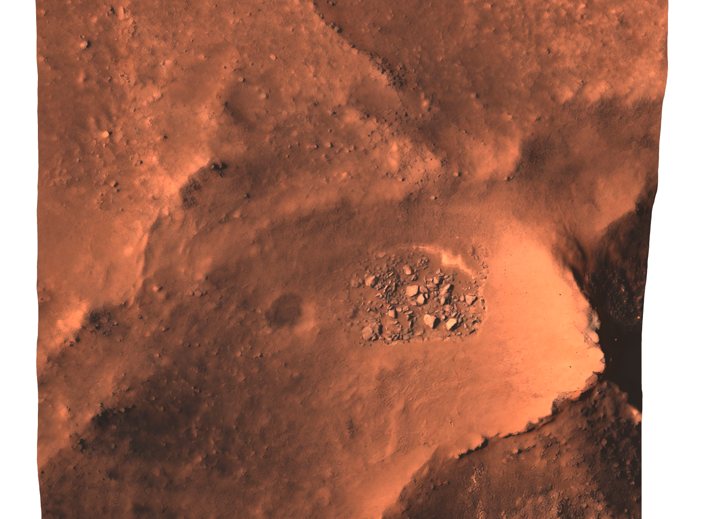
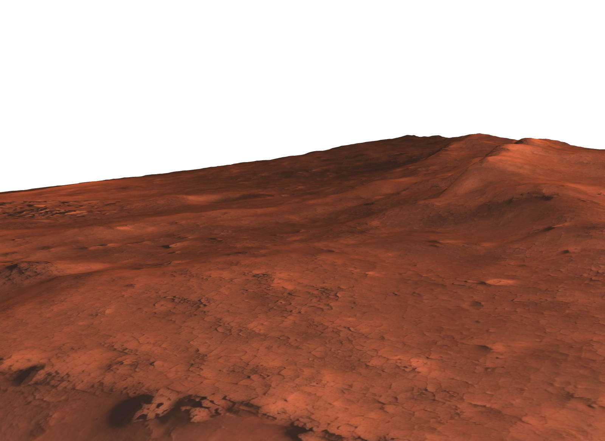

# MarsProject

Grokathon project: generate Mars terrain as `.usda` scenes with Grok Imagine,
to train a rover with RL in Isaac Sim. Worlds are either imagined from a
prompt or seeded from real Jezero Crater orbital data — in both cases Grok
supplies the sub-meter detail that no Mars dataset contains.

**Pipeline that works:** one Grok Imagine call generates the terrain picture
and its heightmap side by side on one canvas — joint generation keeps them
aligned (separate calls drift). Split it: picture → ground texture, filtered
heightmap → terrain mesh. Deterministic Python assembles the `.usda` (mesh,
cameras); `usdchecker` + a proof render gate every build.

**Real-data mode:** the canvas can be seeded from measurement instead of
imagination. Sources are two co-registered USGS mosaics of Jezero Crater,
built from images taken by HiRISE — the highest-resolution camera ever flown
to another planet, aboard NASA's Mars Reconnaissance Orbiter (~280 km
altitude, imaging since 2006). USGS Astrogeology assembled these specific
mosaics as the hazard basemap for the Mars 2020 mission: Perseverance's
Terrain Relative Navigation matched its descent camera against them to pick
a safe touchdown spot during the Feb 2021 landing. The products: the
[HiRISE orthoimage, 25 cm/px](https://astrogeology.usgs.gov/search/map/Mars/Mars2020/JEZ_hirise_soc_006_orthoMosaic_25cm_Eqc_latTs0_lon0_first)
and the
[stereo DTM, 1 m/px](https://astrogeology.usgs.gov/search/map/Mars/Mars2020/JEZ_hirise_soc_006_DTM_MOLAtopography_DeltaGeoid_1m_Eqc_latTs0_lon0_blend40).
The DTM comes from [stereo photogrammetry](https://www.uahirise.org/dtm/about.php):
two HiRISE images of the same ground from different orbital angles; per-pixel
parallax gives height at ~1 m posts (vertical precision tens of cm), tied to
the MOLA datum. 1 m/px is the resolution limit of orbital elevation
measurement, while the imagery resolves ~30 cm features — so rover-scale
geometry (rocks of 0.2–0.5 m) is visible in the photo but absent from the
elevation. `seed_canvas.py` extracts a 160×180 m patch by ranged HTTP reads
(the multi-GB mosaics are never downloaded) and composes a
`[photo | elevation]` canvas; **Grok Imagine** then redraws both halves at
higher detail, keeping landforms in place — the Grok agent crafts the edit
prompt itself, drawing on its `grok_skills/` prompt-craft and its own tuning
with Grok Imagine, and the result is new 3D surface values: elevation the
instruments never measured. Purpose-trained networks have shown DTM estimation
from single orbital images is viable for planetary science; we do it with a
general-purpose image model, zero-shot, texture and heightmap jointly —
showing the potential of foundation image models for 3D surface
reconstruction in planetary applications. Added detail is plausible rather
than measured; the ≥1 m structure remains the real terrain.


Two acceptance gates per real-data world: the heightmap detail ratio (v1),
plus correlation of the height half against the source DTM — rejects runs
where the model reproduces photo luminance instead of elevation. Prompt
phrasing determines which you get: "keep every shadow" → photo copy
(r ≈ 0.3 vs DTM), the v1 "matte pure elevation" wording → usable heightmap
(r ≈ 0.8–0.98 on accepted worlds).


Same patch after the recursive upscale, base res vs final texture:


**Prompt-craft:** write prompts fresh from `grok_skills/` (taken from the
grok-build CLI); don't hardcode them.

## Run

Headless `grok -p` auths via `XAI_API_KEY` (exported in `~/.zshrc`).

```
for m in canvas rock regolith sky; do .venv/bin/python scripts/generate_assets.py --mode $m; done
.venv/bin/python scripts/build_scene.py               # assets/ -> mars_scene.usda
.venv/bin/python scripts/generate_worlds.py --count 8       # imagined worlds
.venv/bin/python scripts/generate_real_worlds.py --count 10 # real Jezero worlds
usdchecker mars_scene.usda
usdrecord --camera /World/Cameras/HeroCam mars_scene.usda renders/hero.png
```

Untouched Grok outputs are kept in each world's `assets/grok_originals/` for
provenance; real-data worlds also keep the seed canvas, `real_dtm.npy` and a
`meta.json` with patch coordinates and gate scores. The world is kept small
(~44 m wide) so the canvas texture stays dense, and the ground gets a tiled
regolith detail multiply for close-up resolution; basalt-textured boulders
and a textured sky dome finish the look.

Cameras: `/World/Cameras/OverheadCam` (top-down), `/World/Cameras/HeroCam`
(3/4 view), `/World/Rover/RoverCam` (first-person mast view, for RL
observations).





The same spot built from the raw data alone vs the full pipeline:


